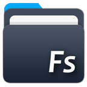

[](https://travis-ci.org/Mercandj/file-android)
[](https://github.com/Mercandj/file-android/releases/tag/1.00.36)
[](http://kotlinlang.org) 
[](https://ktor.io/) 
[](https://play.google.com/store/apps/details?id=com.mercandalli.android.apps.files)

# File manager on Android

Light file manager app. Browse and manager your files.

<a href='https://play.google.com/store/apps/details?id=com.mercandalli.android.apps.files'>
    
</a>

* Copy / Cut / Paste
* Open multimedia (musics, videos, pdf, apk...)
* Online
* Dark theme
* Take notes

<a href='https://play.google.com/store/apps/details?id=com.mercandalli.android.apps.files&pcampaignid=MKT-Other-global-all-co-prtnr-py-PartBadge-Mar2515-1'>
    
</a>

<br/>

<a margin="20px 0 20px 40px" href="https://play.google.com/store/apps/details?id=com.mercandalli.android.apps.files">
	
</a>


## Project structure

- `./app` [here](./app)

Module of the Android app for mobile and tablet devices.
Apk generated is produced on the 
[PlayStore](https://play.google.com/store/apps/details?id=com.mercandalli.android.apps.files) or 
downloadable in the [release](https://github.com/Mercandj/file-android/releases) section.

- `./app_tv` [here](./app_tv)

Module of the Android TV devices.
Apk generated is produced on the 
[PlayStore](https://play.google.com/store/apps/details?id=com.mercandalli.android.apps.files) or 
downloadable in the [release](https://github.com/Mercandj/file-android/releases) section.

- `./config` [here](./config)

Contains all the shell scripts, extra gradle files, authentication, signature...

- `./config/play-store` [here](./config/play-store)

Automatic publish Android app bundle on the play store.

- `./config/quality` [here](./config/quality)

Code quality gradle tools.

- `./config/signing` [here](./config/signing)

App signing data.

- `./gradle/wrapper` [here](./gradle/wrapper)

Default location of gradle wrapper. All Android Studio and gradle project have this kind of folder.

<br/>


## Run the server

* ```./run-server.sh```

<br/>


## Run the CI checks

Check the project with unit tests, lint...

* ```./config/ci/ci.sh```

<br/>


## Commit rules

In order to have a clean commit list and to easily find feature of a commit (goal, fix bug...), the commit message should respect some rules.

Commit messages are important. They are the only way to give context to the changes that are made in a commit. We tend to neglect our commit messages. In a collective attempt at having better commit messages, this project checks some minimal requirement that all of our commit messages should follow.

* Mandatory rules check by the ci: `[Player] Improve the player X control` where the `[` and `]` surround the feature.
* Optional rules emoji: `[Player] :fire: Fix the player X control` where emoji could be the one you want or one of this one:
    * :fire: `:fire:` Fix a bug.
    * :wrench: `:wrench:` Feature dev that is not ui.
    * :art: `:art:` UI commit, readme, all that is visible.
    * :recycle: `:recycle:` Clean, reformat, refactor, ortho, typo...
    * :seedling: `:seedling:` New feature, first commit.
* Optional: Write the `Why`, the `Reason` of your commit in the message description.

Do our future selves a favour and start writing better commit messages now :)

<br/>


## Some developer gradle tools

* ```./gradlew dependencyUpdates -Drevision=release -DoutputFormatter=json``` : Check [dependencies](https://github.com/ben-manes/gradle-versions-plugin)

<br/>


## Previous project

This project is the 2nd version of [this repository](https://github.com/Mercandj/FileSpace-Android): all the project has been re-written in kotlin with a modular architecture.

<br/>


## Developer

* Mercandalli Jonathan

